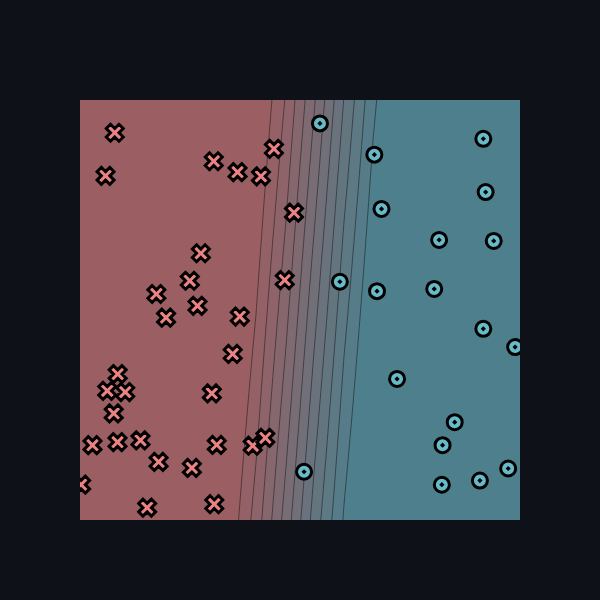

[](https://classroom.github.com/online_ide?assignment_repo_id=20934344&assignment_repo_type=AssignmentRepo)
# MiniTorch Module 0


* Docs: https://minitorch.github.io/

* Overview: https://minitorch.github.io/module0/module0/

This project is my implementation of the first module of MiniTorch.

## Task 0.5: Visualization

I have successfully implemented the visualization component that allows for interactive adjustment of model parameters. Here is a screenshot of the interface:



My parameters:
``` json
{
    "linear_weight_0_0": -10.0,
    "linear_weight_1_0": 0.76,
    "linear_bias_0": 4.50
}
```
